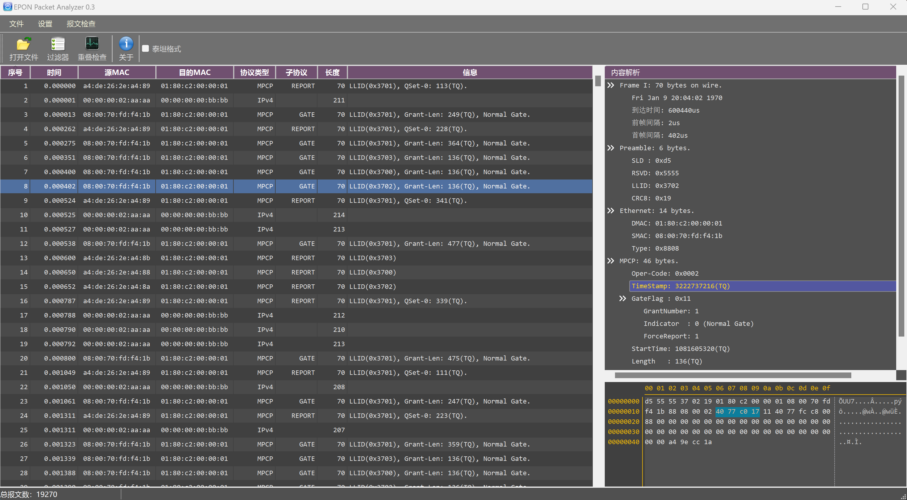

# README

## Introduction
EPON packet parser is a tool that parsing EPON protocol, written by QT 6.2.
## Features
+ Only support .pcap format file.
+ Parse frames and show them in tree view.
+ Show frames in a HEX window. 
+ Highlight related HEX number if field is selected in tree view.
+ Basic sorting function based on Sequence No, SA, DA, Time, Protocol and Info.
+ Basic filter function.
+ MPCP Window overlapping check.
## How to Compile
+ Use QT 6.x Qt Creator.
+ Open CMakeLists.txt to construct project.
+ Build and Run.
## Note
You should copy qss files to debug/release directory.
## Demo

